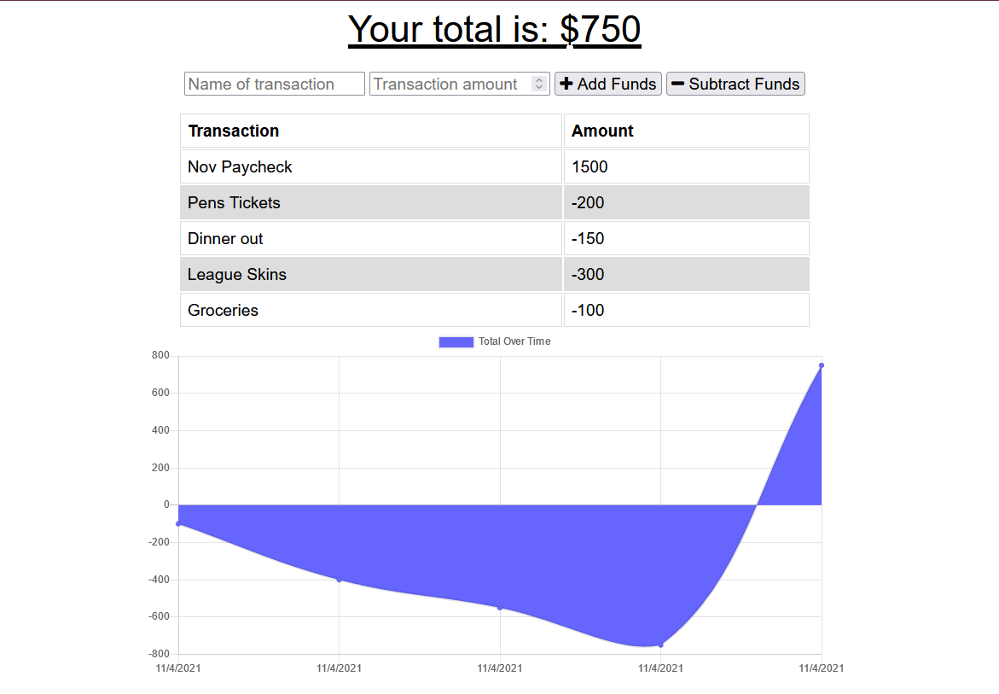

# Budget-Tracker

## Description

This application allows for tracking of a budget using MongoDB, IndexedDB, and the service-workers and manifest of Progressive Web Apps (PWAs). The user can post transactions which will update the graph on the screen. When offline, these transactions will be stored in IndexedDB so that, once back online, the chart will update and transactions will process. As a PWA, the user can also download/install the app onto a desktop or mobile device. 

Here is a screenshot of the deployed app:

Here is a link to the Heroku deployment: [Heroku Deployment](https://hidden-taiga-71157.herokuapp.com/)

## Table of Contents

-- [Installation](#installation)

-- [Usage](#usage)

-- [License](#license)

-- [Contributing](#contributing)

-- [Tests](#tests)

-- [Questions](#questions)

## Installation

Nothing needs to be installed on the Heroku deployment. The app will function upon navigation to the address. However, if the repo will be cloned to your local machine for usage on your own localhost:

To install necessary dependencies, run the following command:

    npm i

## Usage

Navigate to the Heroku link provided above to get to the deployed app.

Again, if the repo is cloned to your machine and all the necessary devices are installed, your localhost can be spun up using the command

    node/server.js

Once on the Heroku app or with the server spun up, this PWA can be downloaded/installed on a desktop/mobile device and can queue transactions while offline which will be sent to the database upon reconnection to the internet. The graph will update and show recent transactions.

## License

This project is protected under the [MIT](https://choosealicense.com/licenses/mit/) license. (2021) (Phil Bohn)

## Contributing

N/A

## Tests

N/A

## Questions

If there any questions regarding this project, I can be contacted in the following places:

GitHub: [@lamperouge1218](https://github.com/lamperouge1218)

Email: philbohn1791@gmail.com
